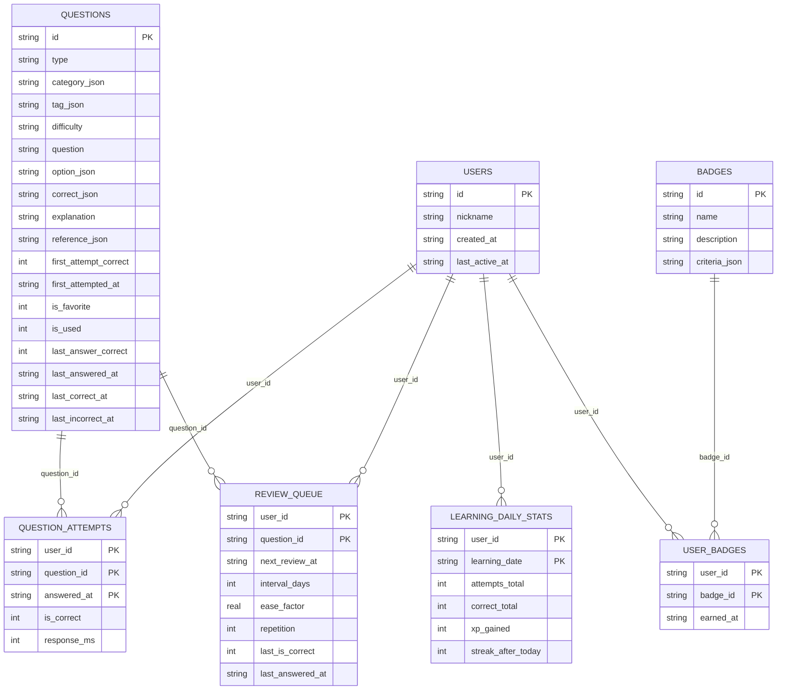

# SQLite Schema – AnesQuiz "プレα"

- `*_json` と付くカラムには配列やオブジェクトを JSON 文字列として保存します。
- `LearningDailyStats` はその日の解答数や経験値を集計して保存するテーブルです。
- `ReviewQueue` は SuperMemo-2 法に基づき次回復習日を管理します。
- `QuestionAttempts` は 1 回の解答を 1 行として保持し、後から弱点分析に利用します。

