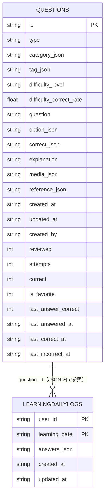

# SQLite Schema – AnesQuiz "プレα"

- `Questions` テーブルのみを使用します。
- 各カラムはアプリで扱う `Question` 型（`types/firestore.ts`）に対応しています。
- `*_json` と付くカラムは配列やオブジェクトを **JSON 文字列** として保存しています。
- `reviewed` は **0/1 の整数**で、`boolean` として扱います。
- 統計情報として `attempts` (解答数) と `correct` (正解数) を記録します。

このファイルを参照すれば、SQLite の現在の構造を簡単に確認できます。
