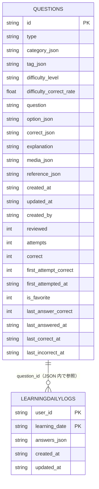

# SQLite Schema – AnesQuiz "プレα"



- `Questions` テーブルのみを使用します。
- 各カラムはアプリ側の `Question` 型 (`types/firestore.ts`) に対応します。
- 現在は **SQLite のみ** でデータを管理します。
- `*_json` と付くカラムは配列やオブジェクトを **JSON 文字列** として保存しています。
- `reviewed` は **0/1 の整数**で、`boolean` として扱います。
- 統計情報として `attempts` (解答数)、`correct` (正解数) に加え
  `first_attempt_correct` と `first_attempted_at` を記録します。

### LearningDailyLogs テーブルの記録ルール

`LearningDailyLogs` は 1 日分の学習履歴を 1 行にまとめます。`learning_date` は `YYYY-MM-DD` 形式の日付文字列です。
`answers_json` には下記のように問題 ID ごとの解答回数と正解回数を保存します。

```json
{
  "an0000001": { "attempts": 3, "correct": 2 },
  "an0000042": { "attempts": 1, "correct": 0 }
}
```

同じ日に解答した場合は既存レコードを更新し、`attempts` と `correct` を増やします。

このファイルを参照すれば、SQLite の現在の構造を簡単に確認できます。
